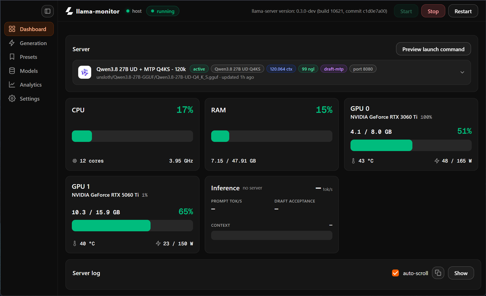
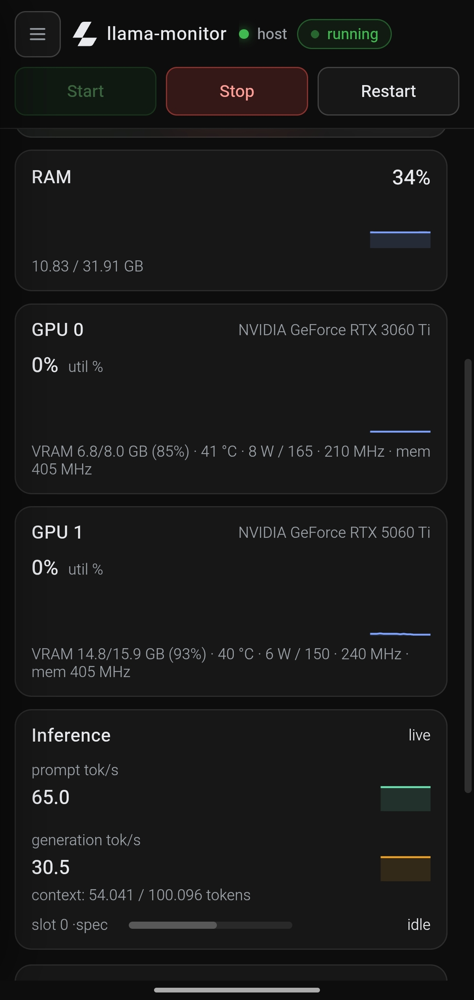

# llama-monitor

A lightweight web control panel for a local `llama-server` (llama.cpp) instance.
Run it on the same machine as the server, open it in a browser (from the same
machine or over Tailscale), and manage everything without touching the command
line:

- **Process control** — start / stop / restart `llama-server` as a child process,
  with live stdout/stderr streaming in a terminal panel.
- **Presets** — full CRUD on launch configurations, stored as *semantic*
  settings (never raw CLI strings). A translation layer converts them to real
  `llama-server` flags at launch time, and validates them against the actually
  installed version via `llama-server --help` — unknown flags are reported as
  warnings instead of blocking the start. Speculative decoding is organized
  per technique (MTP, DFlash, DSpark, draft-simple, EAGLE-3); types the
  installed build doesn't document are greyed out in the editor and blocked
  at launch with a clear message.
- **Resource monitoring** — CPU (per-core), RAM, and one card per detected GPU
  (utilization, VRAM, temperature, power draw) via `nvidia-smi`,
  plus inference metrics (prompt/generation tok/s, per-slot context usage,
  draft acceptance for spec decode) sourced from the server's own log lines,
  with `/slots` and `/metrics` as fallbacks.
- **Generation parameters** — sampling / penalties / control fields that are
  *not* launch flags: they are injected into every proxied
  `/v1/chat/completions` and `/completion` request, so they can be changed at
  any time without restarting the server.
- **Model browser** — recursive scan of `models_root` for `.gguf` files with
  size/sort, plus automatic mmproj (vision) projectors detection per model.
- **Analytics** — per-request history (tokens, latency, energy estimate) in
  SQLite: summary cards, token/speed charts, model breakdown, a request
  table, and CSV export, all with a day/week/month/year/all range picker.
- **Self-updating** — the panel checks the git remote in the background and
  offers a one-click **Update now** (bottom-right toast, also in Settings):
  it pulls the latest commits from the repo and restarts the app. The repo
  ships the code *and* the bundled tray exe (CI commits the latest
  `llama-monitor.exe` back to the repo root, so a plain `git pull` updates
  both). Fast-forward only — unpushed local commits block the update with a
  clear message (in the frozen deployment, leftover local changes from an
  interrupted update are recovered automatically). A running model server is kept across the
  update (the restarted panel re-detects it), so inference is not
  interrupted. The first launch after an update can take a while — the
  relaunched tray exe re-extracts its bundle on start, and the panel
  reports the wait live (up to ~5 min).

## Screenshots

Desktop view:



Mobile view:



## Requirements

- Python 3.10+ (tested on 3.11/3.14)
- Windows or Linux
- A `llama-server` binary (llama.cpp) on the same machine — **only needed to
  launch the server**; the panel, monitoring, model browser, and presets all
  work without it (Start/Restart just fail until the exe path is set)
- NVIDIA GPU driver providing `nvidia-smi` (optional — GPU cards are hidden
  when no GPU is detected; works on CPU-only machines too)

## Install

```bash
git clone https://github.com/Leo00703/llama-monitor
cd llama-monitor
python -m venv .venv
# Windows: .venv\Scripts\activate   |   Linux: source .venv/bin/activate
pip install -r requirements.txt
```

## Configure

All persistent data (config, presets, analytics history) lives in a stable
per-user directory **outside the repository**, so `git pull`, fresh clones,
`git clean`, or sync tools can never wipe it:

- Windows: `%APPDATA%\llama-monitor\`
- Linux/macOS: `~/.config/llama-monitor/` (or `$XDG_CONFIG_HOME/llama-monitor`)
- Override: set the `LLAMA_MONITOR_DATA` environment variable

On first start the config is seeded from `config.example.json` (or migrated
from a legacy in-repo `config.json` / `data/` if present). Edit it with the
in-app **Settings** page (which shows the data directory in use):

| Key | Meaning |
| --- | --- |
| `llama_server_exe` | Path to the `llama-server` executable (or a bare name found in `PATH`) |
| `models_root` | Root folder scanned for `.gguf` models; preset model paths are relative to it |
| `default_server_port` | Port assumed for external/ready checks when nothing else is known |
| `panel.host` / `panel.port` | Bind address/port of the panel itself (default `0.0.0.0:8000`, so it is reachable over Tailscale) |
| `active_preset_id` | Preset currently selected for launches |
| `energy_price_eur_kwh` | € per kWh, used for the cost estimates on the Analytics page |
| `energy_overhead_w` | Constant idle-system wattage added to the GPU power estimate |
| `update_check_minutes` | Self-update background poll interval (0 disables the check) |

## Run

```bash
python -m uvicorn backend.main:app --host 0.0.0.0 --port 8000
```

Then open `http://<server-ip>:8000` in a browser. Point your OpenAI-compatible
clients at `http://<server-ip>:8000/proxy/v1/...` to have generation parameters
applied to every request through the panel.

> Note: the panel only manages `llama-server` processes it started itself.
> If a server is already running on the configured port, the panel marks it
> as **external** and can still stop it.

## Tray launcher (Windows .exe)

For Windows there is a single-file `.exe` that runs the whole panel in the
system tray — no console, no browser tab needed for the panel itself. The tray
icon mirrors the server state (colored status dot + tooltip) and its menu has
**Open panel**, **Start / Stop server**, and **Quit**. The panel is embedded in
the same process (uvicorn in a daemon thread) on the configured
`panel.host:panel.port`, so OpenAI-compatible proxying works exactly as above.

- **Get it** — `llama-monitor.exe` at the repo root is the latest CI build:
  `git clone` (or `git pull` / the in-app **Update now**) and run it. A fresh
  build is also uploaded as an artifact by the `Build Windows tray exe`
  GitHub Actions workflow on every push to `main` (or run the workflow
  manually).
- **Build locally** — `build_exe.bat` (creates/updates `.venv`, installs deps,
  runs a headless smoke test, then PyInstaller) produces
  `dist\llama-monitor.exe`.
- **Run from source** — `python tray.py` (Windows only; `--smoke` runs the
  headless self-test used by CI).

A single-instance mutex prevents duplicate panels; a log is written to
`launcher.log` in the data directory.

## Project layout

```
backend/
  main.py        FastAPI app: REST API, WebSockets, static frontend
  config.py      config loading/saving + user-data-dir resolution & legacy migration
  schema.py      Pydantic models for launch settings, specs, and API payloads
  process.py     llama-server child-process manager (state machine, log capture)
  flags.py       semantic settings -> CLI flags translation + --help validation
  spec/          speculative decoding: one module per technique (mtp, dflash,
                 dspark, draft-simple, eagle3) + registry
  presets.py     preset CRUD (JSON files under <data-dir>/presets)
  metrics.py     CPU/RAM (psutil), GPU (nvidia-smi), inference metrics
  models.py      recursive .gguf browser + mmproj detection
  proxy.py       /v1/chat/completions & /completion proxy with settings injection
  analytics.py   print_timing parser + SQLite request/energy history
  update.py      git self-update (fetch/ff-only pull of origin, version info)
llama-monitor.exe    latest CI-built tray exe, tracked at the repo root so
                     `git pull` always ships it
config.example.json  template documenting every config key
frontend/
  index.html     single-page app (vanilla HTML/CSS/JS, no build step)
  css/style.css  official llama.cpp dark theme
  js/            app shell (app.js), api/ui/metrics/update helpers, pages/
                 (dashboard, generation, presets, models, analytics, settings)
  fonts/         bundled Geist Mono (woff2)
tray.py          Windows system-tray launcher (embeds the panel, --smoke self-test,
                 --restarting handoff for the update relaunch)
build_exe.bat    local PyInstaller build of dist\llama-monitor.exe
requirements-tray.txt   extra deps for the tray launcher (pystray, Pillow, pyinstaller)
assets/tray/     tray mark (PNG) + exe icon (ICO)
docs/            README screenshots
.github/workflows/build-exe.yml   CI: smoke test + PyInstaller + artifact upload +
                     commit the refreshed exe back to the repo root
```

Persistent data lives outside the repo (see Configure): config.json,
presets/, analytics.db under `%APPDATA%\llama-monitor` (Windows) or
`~/.config/llama-monitor` (Linux/macOS).

## Development phases

The panel is built in incremental phases (see `Implementation Plan.md`):

1. Process start/stop/restart + live log streaming — done
2. Preset system (CRUD, JSON storage, flag translation layer) — done
3. Resource monitoring (CPU/RAM/GPU, inference metrics) with history charts — done
4. Model browser, mmproj, speculative decoding, generation parameters + proxy — done
5. Analytics: usage history (SQLite), energy cost, historical charts — done
6. Header (status/version/host), collapsible sidebar, design polish — done
